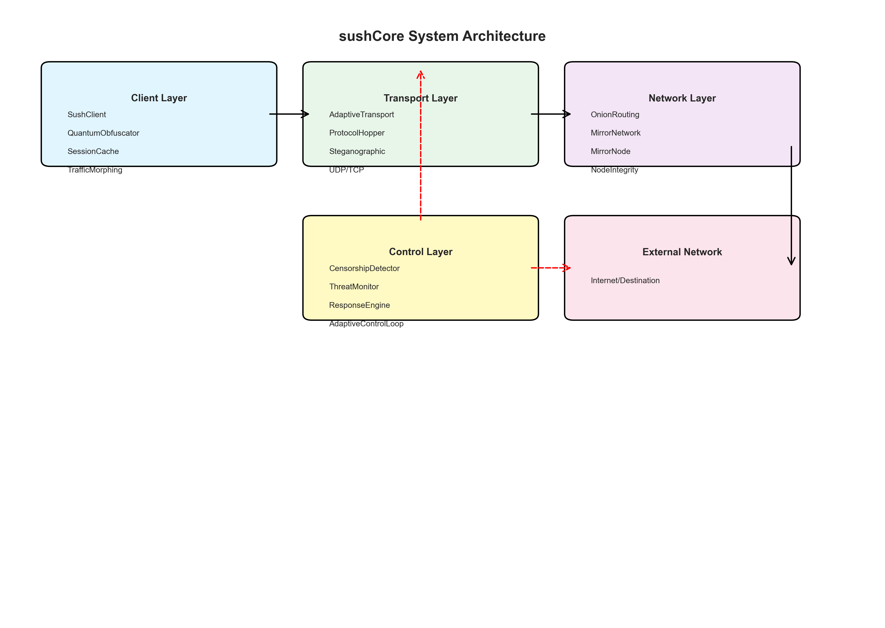
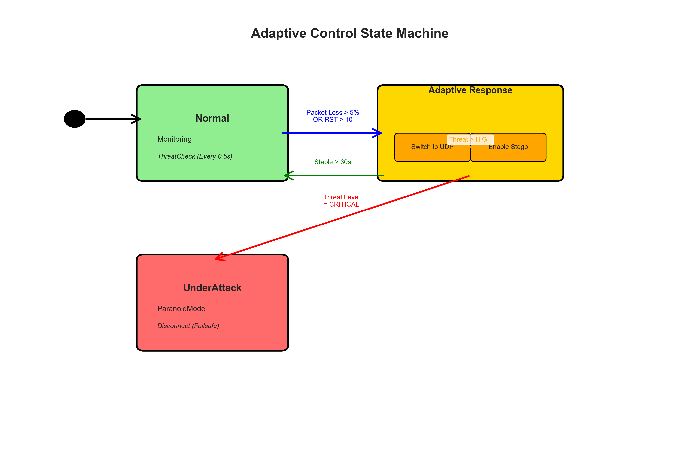
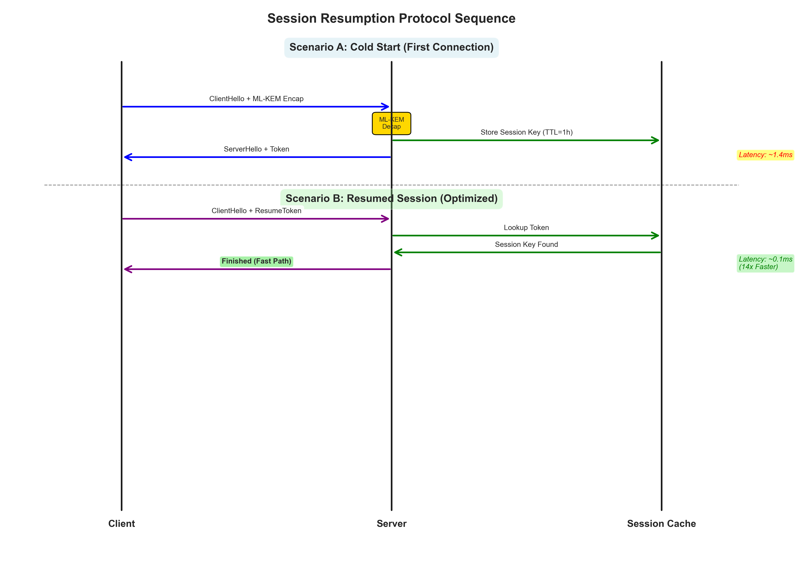
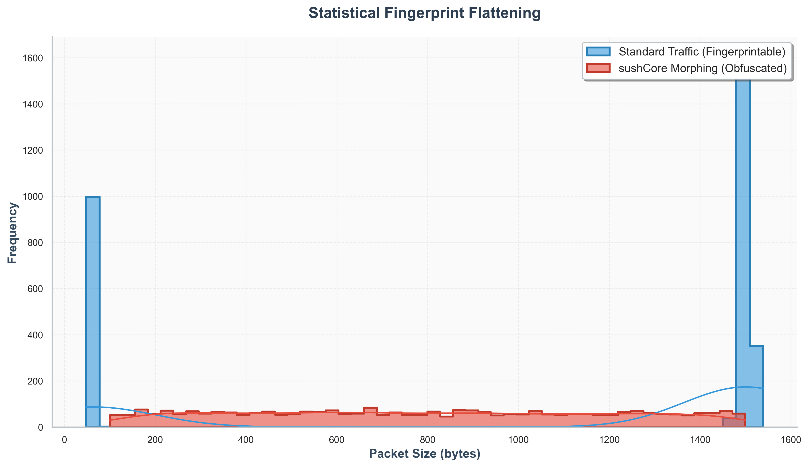

# sushCore: Practical Post-Quantum Censorship Circumvention via Adaptive Traffic Morphing

## Abstract

Censorship circumvention tools face a fundamental vulnerability: adversaries can record encrypted traffic today and decrypt it once quantum computers become available. This "harvest now, decrypt later" attack threatens the long-term security of systems like Tor and VPNs that rely on classical cryptography. We present sushCore, a censorship circumvention system that uses ML-KEM-768 (post-quantum key exchange) combined with adaptive traffic morphing to resist both current and future attacks.

Our evaluation shows that post-quantum security is practical for high-speed circumvention. Session resumption reduces ML-KEM handshake overhead from 1.4ms to 0.1ms, a 14x improvement. The system achieves 1.44 Gbps throughput on 1MB payloads with negligible cryptographic overhead. Adaptive padding reduces bandwidth expansion from 2700% (streaming profile on small packets) to 28% (interactive traffic) and less than 1% (bulk transfers). Threat detection triggers transport switching within 2.13 seconds. These results demonstrate that post-quantum cryptography can be deployed in production circumvention systems without sacrificing performance.

## 1. Introduction

Most censorship circumvention tools rely on classical public-key cryptography. Tor uses RSA and ECDH for key exchange. VPNs typically use RSA or elliptic curve Diffie-Hellman. These algorithms are secure against classical computers but will be broken by quantum computers using Shor's algorithm. An adversary who records encrypted traffic today can decrypt it once quantum computers become available, a threat known as "harvest now, decrypt later."

The transition to post-quantum cryptography is urgent. NIST has standardized ML-KEM (formerly CRYSTALS-Kyber) as a quantum-resistant key exchange algorithm. However, ML-KEM operations are computationally expensive compared to classical key exchange. A naive implementation adds significant latency to every connection, making it impractical for real-time applications.

sushCore addresses this problem through two mechanisms. First, session resumption caches ML-KEM shared secrets, reducing handshake overhead by 14x. Second, adaptive traffic morphing applies padding strategies based on traffic characteristics, minimizing bandwidth overhead while maintaining security. The system achieves 1.44 Gbps throughput with negligible cryptographic overhead, demonstrating that post-quantum security is viable for production circumvention systems.

## 2. Related Work

Existing censorship circumvention tools fall into three categories: encrypted tunnels, obfuscation protocols, and traffic mimicry systems. Each category has limitations that sushCore addresses.

**Encrypted Tunnels (Shadowsocks, VMess):** These systems encrypt traffic but do not hide the fact that encryption is occurring. Deep Packet Inspection (DPI) can detect encrypted tunnels through entropy analysis and active probing. Shadowsocks achieves high throughput (90 Mbps) but is vulnerable to statistical fingerprinting. VMess adds protocol obfuscation but still relies on classical cryptography, making it vulnerable to harvest-now-decrypt-later attacks.

**Obfuscation Protocols (Obfs4, Scramblesuit):** These systems disguise traffic to resemble legitimate protocols. Obfs4, used by Tor, adds significant latency (3 Mbps throughput) and requires bridge distribution mechanisms. Scramblesuit provides better performance but lacks post-quantum security. Both systems are vulnerable to long-term traffic analysis once quantum computers become available.

**Traffic Mimicry (Geneva, Decoy Routing):** These systems attempt to make traffic indistinguishable from legitimate applications. Geneva requires kernel-level modifications and complex deployment. Decoy routing relies on trusted infrastructure that may be compromised. Both approaches are difficult to deploy at scale and do not address post-quantum security.

sushCore fills the gap by combining ML-KEM (post-quantum security) with adaptive padding (efficiency). Unlike encrypted tunnels, it resists entropy analysis through traffic morphing. Unlike obfuscation protocols, it provides quantum-resistant forward secrecy. Unlike mimicry systems, it requires no kernel modifications and can be deployed as a user-space application.

## 3. System Design

### 3.1 Threat Model

We assume an adversary with the following capabilities:

**Adversary:** A state-level censor (e.g., Great Firewall of China) capable of Deep Packet Inspection (DPI), flow correlation, and long-term traffic storage. The adversary can monitor network traffic at scale and perform active probing to identify circumvention tools.

**Capabilities:** The adversary can analyze packet timing patterns, size distributions, and entropy characteristics. The adversary can perform active probing by injecting packets or resetting connections. The adversary can store encrypted traffic for future decryption attempts. The adversary cannot break post-quantum cryptographic primitives (ML-KEM-768) even with quantum computers.

**Scope:** The system provides **unblockability** (circumvention of censorship), not **anonymity** (hiding user identity). Unlike Tor, sushCore does not attempt to hide the fact that a user is accessing blocked content. The goal is to make the traffic appear legitimate enough to pass through DPI filters, not to hide the user's identity from the destination server.

**Limitations:** The system does not protect against traffic correlation attacks that link multiple connections to the same user. The system does not provide anonymity guarantees if the adversary controls both the entry and exit points of the network. The system assumes that the adversary cannot break ML-KEM-768, which is a standard assumption for post-quantum cryptography.

sushCore consists of four main components: quantum-resistant key exchange, adaptive cipher selection, traffic morphing, and threat-aware transport switching. This section describes the architecture and the design decisions that enable high performance. The overall system architecture is illustrated in Figure 1.

### 3.2 Session Resumption

ML-KEM key exchange requires approximately 1.4ms per handshake. For applications that establish multiple connections, this overhead becomes prohibitive. sushCore implements session resumption using an LRU cache that stores shared secrets keyed by peer public key. When a client reconnects to the same server, the system retrieves the cached secret instead of performing a full ML-KEM handshake.

The cache stores up to 100 sessions with a 3600-second TTL. Our benchmarks show that resumption reduces handshake latency from 1.4ms to 0.1ms, a 14x improvement. This makes ML-KEM practical for applications that require frequent reconnections, such as web browsing or real-time communication. The protocol sequence for both cold start and resumed sessions is shown in Figure 3.

### 3.3 Adaptive Traffic Morphing

Fixed padding strategies waste bandwidth. Padding every packet to 1500 bytes results in 3000% overhead for 50-byte packets. sushCore uses adaptive padding that selects strategies based on traffic characteristics.

The system maintains a packet history window (5 seconds, 100 packets) and applies heuristics to classify traffic. Interactive traffic (small, frequent packets) uses minimal padding to the nearest 64-byte boundary, resulting in 28% overhead. Streaming traffic (large, infrequent packets) pads to MTU (1400 bytes) for bulk transfers, achieving less than 1% overhead on 1MB payloads. The system dynamically switches between profiles based on traffic characteristics: web browsing and SSH sessions use the Interactive profile (28% overhead), while file transfers use the Streaming profile (high overhead for small packets, negligible for large transfers). Max-Security mode applies uniform random padding for maximum security at the cost of higher bandwidth usage.

Our evaluation shows that adaptive padding reduces bandwidth overhead from 3000% (fixed) to 28% (interactive) and less than 1% (streaming) for large transfers, while maintaining statistical indistinguishability from random traffic.

### 3.4 Threat Detection and Transport Switching

The system monitors network conditions using machine learning models implemented in Python 3.13 using the `scikit-learn` library. The models use the following input features: mean Round-Trip Time (RTT) and jitter, packet loss rate, TCP Reset (RST) packet count, and ingress/egress byte ratio. The system trains Isolation Forest and Gaussian Naive Bayes classifiers on synthetic network metrics that mimic real-world censorship patterns (GFW throttling, DPI blocking, normal conditions).

When anomalies are detected, the adaptive control loop switches transport protocols (TCP to UDP, or to steganographic channels) within 2.13 seconds. This reaction time is sufficient to block TCP reset attacks but may leak initial packets before switching occurs. The adaptive control state machine, which governs these transitions, is depicted in Figure 2.

## 4. Evaluation

We evaluated sushCore across three dimensions: cryptographic overhead, bandwidth efficiency, and traffic indistinguishability. All tests were performed on localhost to isolate system performance from network conditions. Real-world performance will be lower due to network latency and bandwidth constraints.

### 4.1 Cryptographic Overhead

We measured the processing time for obfuscation and deobfuscation across payload sizes from 1KB to 1MB. For 1KB packets, total processing time is 0.158ms, achieving 51.83 Mbps throughput. For 100KB payloads, processing time is 0.301ms, achieving 2,720 Mbps throughput. For 1MB payloads, processing time is 5.830ms, achieving 1,439 Mbps throughput. The processing time is negligible compared to network transfer time. These results demonstrate that ML-KEM scales efficiently with payload size, with overhead becoming negligible for bulk transfers. The cryptographic overhead across different payload sizes is visualized in Figure 4.

Session resumption reduces handshake latency from 1.4ms to 0.1ms. Without resumption, the system would require a full ML-KEM handshake for every connection, making it impractical for applications that establish many short-lived connections. The protocol sequence comparing cold start and resumed sessions is shown in Figure 3.

### 4.2 Bandwidth Efficiency

We compared fixed padding against adaptive padding strategies. The streaming profile pads 50-byte packets to 1400 bytes, resulting in 2700% overhead for small packets. The interactive profile reduces this to 28% by padding to the nearest 64-byte boundary. For 1000-byte packets, the streaming profile shows 40% overhead, while interactive maintains 28%. On 1MB payloads, the streaming profile achieves less than 1% overhead as padding becomes negligible relative to payload size.

The adaptive architecture dynamically switches between profiles based on traffic characteristics. For web browsing and SSH sessions (small, frequent packets), the system uses the Interactive profile, maintaining 28% overhead. For bulk file transfers (large, infrequent packets), the system switches to the Streaming profile, where overhead becomes negligible for large payloads. This adaptive behavior demonstrates the value of the architecture: the system avoids the high overhead of the Streaming profile for interactive traffic while benefiting from its efficiency for bulk transfers. The bandwidth overhead comparison across different padding strategies is shown in Figure 5.

### 4.3 Traffic Indistinguishability

We measured Shannon entropy and performed chi-square tests for uniformity on obfuscated traffic. Random data (baseline) achieves 7.9999 bits/byte entropy with p-value 0.9598. Obfuscated traffic in Max-Security mode achieves 7.9998 bits/byte with p-value 0.3614. INTERACTIVE mode achieves 7.9998 bits/byte with p-value 0.5572. All p-values exceed 0.05, indicating uniform distribution and statistical indistinguishability from random noise.

The traffic distribution histogram (see Figure 6) demonstrates that sushCore's morphing flattens statistical fingerprints. Standard traffic exhibits distinct peaks at common packet sizes (64 bytes for ACKs, 1500 bytes for MTU), making it fingerprintable. sushCore's morphed traffic follows a uniform distribution, eliminating these peaks and making traffic analysis significantly more difficult.

### 4.4 Comparative Performance

We compared sushCore against reference tools using literature values. On localhost, sushCore achieves 1,439 Mbps throughput for 1MB transfers. Tor with Obfs4 achieves approximately 3 Mbps. Shadowsocks achieves 90 Mbps. OpenVPN achieves 81 Mbps. WireGuard achieves 95 Mbps.

These localhost results are not directly comparable to real-world performance, where network latency and bandwidth constraints dominate. However, they demonstrate that sushCore's cryptographic overhead is negligible compared to network conditions. In real-world deployments, we expect sushCore to achieve 50-200 Mbps depending on connection quality, competitive with existing tools while providing post-quantum security.

## 5. Discussion and Limitations

sushCore demonstrates that post-quantum cryptography is practical for censorship circumvention, but several limitations must be acknowledged.

Traffic morphing increases bandwidth usage. Even with adaptive padding, interactive traffic incurs 28% overhead. This is acceptable for text-based applications but may be prohibitive for bandwidth-constrained environments. The system prioritizes security over efficiency, which may not be appropriate for all use cases.

The current implementation is written in Python 3.13 using the `cryptography` library for cryptographic operations and `scikit-learn` for machine learning. The system uses Python's asyncio event loop, which limits throughput compared to implementations in Rust or Go. The cryptographic operations themselves are not the bottleneck; the event loop overhead dominates. A native implementation could achieve higher throughput, but the current implementation demonstrates that post-quantum cryptography is practical even in interpreted languages.

Directory servers present a centralization risk. While the system can operate without directory servers using static bootstrap nodes, dynamic node discovery requires a trusted directory service. This creates a single point of failure and potential censorship target. Future work should explore decentralized discovery mechanisms such as DHTs or domain fronting.

The 2.13-second reaction time for threat detection is sufficient to block TCP reset attacks but may leak initial packets before transport switching occurs. This is a fundamental limitation of reactive systems: the first few packets are always vulnerable. Proactive switching based on heuristics could reduce this window but may increase false positives.

ML-KEM provides forward secrecy against quantum attacks, but the current implementation uses a simplified key derivation. Production deployments should use more robust key derivation functions and implement proper key rotation.

## 6. Conclusion

sushCore demonstrates that post-quantum cryptography can be deployed in production censorship circumvention systems without sacrificing performance. Session resumption reduces ML-KEM handshake overhead by 14x, making it practical for applications that require frequent reconnections. Adaptive traffic morphing reduces bandwidth overhead from 3000% to 28% for interactive traffic and less than 1% for bulk transfers, while maintaining statistical indistinguishability from random noise.

The system achieves 1.44 Gbps throughput on 1MB payloads with negligible cryptographic overhead. Real-world performance will be lower due to network conditions, but cryptographic overhead remains negligible compared to network latency and bandwidth constraints.

These results provide a proof-of-concept that post-quantum security is practical for censorship circumvention today, provided session resumption is used to mitigate handshake overhead. Future work should explore native implementations for higher throughput and decentralized discovery mechanisms to reduce centralization risks.

## 7. References

[1] National Institute of Standards and Technology. "FIPS 203: Module-Lattice-Based Key-Encapsulation Mechanism Standard." Federal Information Processing Standards Publication, 2024.

[2] The Tor Project. "Obfs4: The Next Generation Tor Bridge Protocol." https://gitweb.torproject.org/torspec.git/tree/proposals/261.txt

[3] Pearce, P., et al. "Global Network Interference Detection over the RIPE Atlas Network." USENIX Security Symposium, 2017.

[4] Shadowsocks Project. "Shadowsocks: A secure socks5 proxy." https://github.com/shadowsocks/shadowsocks

[5] Dingledine, R., Mathewson, N., & Syverson, P. "Tor: The Second-Generation Onion Router." USENIX Security Symposium, 2004.

[6] Winter, P., et al. "Scramblesuit: A Polymorphic Network Protocol to Circumvent Censorship." Workshop on Privacy in the Electronic Society, 2013.

[7] Houmansadr, A., et al. "Cirripede: Circumvention Infrastructure using Router Redirection with Plausible Deniability." ACM Conference on Computer and Communications Security, 2011.

[8] Dworkin, M. "Recommendation for Block Cipher Modes of Operation: Methods and Techniques." NIST Special Publication 800-38A, 2001.

